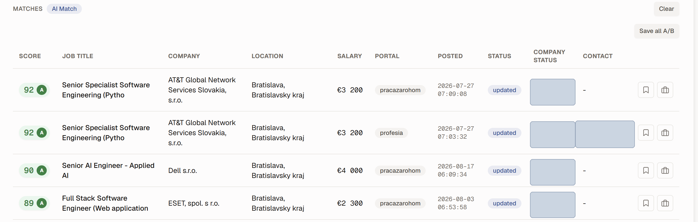
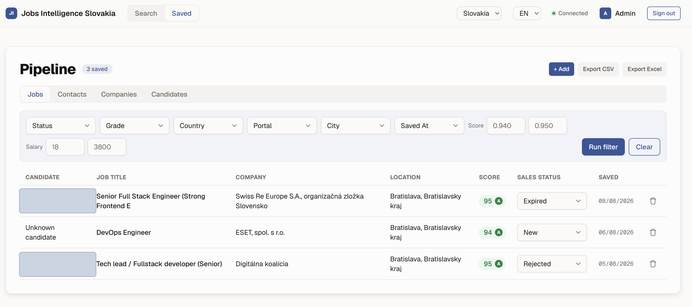
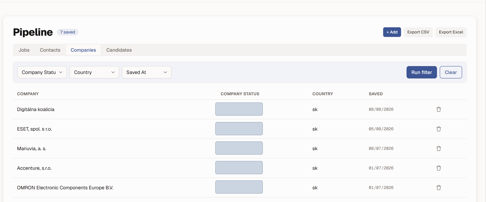

# AI Job Matcher

Flask web app for AI-powered job matching over an **OpenAI vector store + MySQL**, for
European job markets. Search and matching run multiple parallel vector-retrieval cycles
and resolve results against the live database.

> **Note — portfolio / code-reading only.** This repo is published to show the architecture and
> code. It is **not runnable standalone**: it depends on private infrastructure (an OpenAI vector
> store and a MySQL/RDS database that are not included), so `pip install -e .` will install the
> package but the app cannot serve real data without that backend. Read the code and the
> [architecture docs](documentation/jobs_intelligence_ai/ARCHITECTURE.md) rather than expecting to
> boot it locally.

## Screenshots

_Running app (Slovakia profile). Real candidate/contact names and internal CRM status
values are masked; everything else is genuine output. More in [`screenshots/`](screenshots/)._

**Search — AI match results** (jobs scored 0–100 with an A/B grade, saved into a pipeline)



**Pipeline — saved jobs** (editable per-row sales status, filters, CSV/Excel export)



**Pipeline — saved companies**



## Prerequisites

- Python 3.11+
- Network access to the AWS RDS MySQL instance (run from Windows, not WSL)
- An `.env` at the repo root (see `.env.example`) with the DB credentials, OpenAI key, and
  vector-store ids.

## Setup

```bash
pip install -e .
```

This installs the `jobs_intelligence_ai` package (editable) and a `jobs-intelligence-ai`
console script.

## Run

```bash
python -m jobs_intelligence_ai            # Austria (default)
python -m jobs_intelligence_ai --sk       # Slovakia  (alias for --country sk)
jobs-intelligence-ai --sk                 # same, via the installed console script
```

Then open **http://localhost:5000** (default login `admin` / `admin`).

The active country is chosen at launch (CLI flag → `COUNTRY` env var → Austria default) and
selects which credentials and vector store apply.

## Verify DB columns

Open **http://localhost:5000/debug/schema** — returns the live column names of the active
country's read view. Compare against the `COL` mapping in
[`src/jobs_intelligence_ai/config/profiles.py`](src/jobs_intelligence_ai/config/profiles.py)
and update any that differ.

## Project structure

```
.
├── pyproject.toml                  # package metadata, deps, console script
├── .env / .env.example             # credentials (root; .env is gitignored)
├── data/sql/                       # schema DDL (app pipeline tables)
├── documentation/                  # mirrors src/ (per-module docs)
├── scripts/                        # manual/dev runners (preview, guided_chat, fixtures)
├── tests/                          # mirrors src/ (pytest, scaffolded)
├── design/                         # wireframes, diagrams, mockups, sales spec
└── src/jobs_intelligence_ai/
    ├── __main__.py                 # `python -m jobs_intelligence_ai`
    ├── config/                     # settings.py, profiles.py (per-country COL/read_view)
    ├── core/                       # chat, matching, database, job_detail, categories
    ├── web/                        # app.py (create_app factory) + blueprints/ + templates/
    ├── services/                   # auth, candidate store, reports, classifiers, enrichers
    ├── stats/                      # salary stats, opportunity radar, quality scoring
    ├── integrations/               # external APIs (LinkedIn via Apify)
    └── rag/                        # vector-store chat + example extraction tooling
```

## Architecture

See [`documentation/jobs_intelligence_ai/ARCHITECTURE.md`](documentation/jobs_intelligence_ai/ARCHITECTURE.md)
for the request flow, and [`.../core/DATABASE.md`](documentation/jobs_intelligence_ai/core/DATABASE.md)
for the data model (views, the matching read-view, and query patterns).
